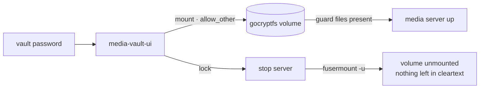

# media-vault-ui

A minimal web UI to unlock an encrypted media library on demand and bring its
media server up and down with it. One password unlocks a `gocryptfs` volume, and
locking it tears the mount down again, so the media only exists in cleartext
while someone is actually watching.

## What it does
- Prompts for the vault password and mounts the encrypted directory with
  **gocryptfs** (`-allow_other`), then starts the media server
- **Lock** unmounts the volume (`fusermount -u`) after stopping the server, so
  nothing is left decrypted on disk
- Shows live status: mount state, `allow_other` flag, and per-container health

## Security details worth noting
- The password is written to a **`0600` temp file** in the runtime dir and
  deleted immediately after `gocryptfs` consumes it. It is never passed on argv
- **Start-guard files** must be present inside the mount before the server is
  allowed to start, so it cannot come up against an empty or half-mounted
  directory
- The whole thing binds to loopback and sits behind a reverse proxy

## Stack
- **Python** standard library only (`http.server`), no web framework
- **gocryptfs** (FUSE) for the encrypted volume, **Docker Compose** to drive the
  media containers, `findmnt`/`mountpoint`/`fusermount` for mount management
- Single file (`app.py`), about 350 lines, server-rendered HTML with a little
  vanilla JS

MIT licensed.
